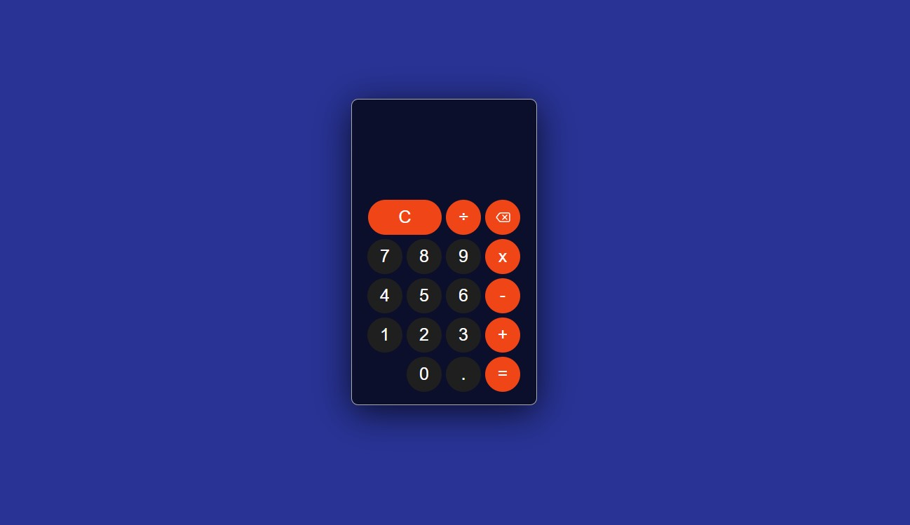

<h1 align="center">
🧮 Calculadora
</h1>

<h4 align="center"><a href="https://calculadora-theta.vercel.app/">Clique para visitar o projeto!</a></h4>

<h3>Linguagens usadas</h3>
<ul>
 <li>HTML5
 <li>CSS3
 <li>JavaScript
</ul>
